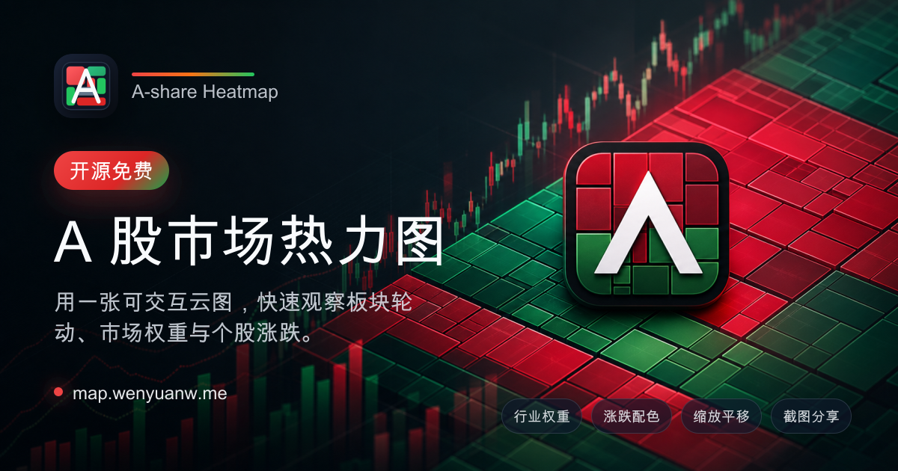
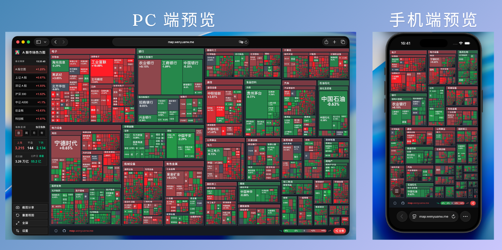

<p align="center">
  
</p>

# A 股市场热力图

一个开源的 **A 股大盘云图** 项目，把整个 A 股市场浓缩成一张可交互的 **A 股市场热力图**。色块大小代表个股流通市值权重，颜色深浅代表当日涨跌幅，让你在几秒钟内看清沪深两市的涨跌结构、行业板块轮动和资金流向。

支持沪深 A 股全图、沪深 300、中证 A500、创业板、科创板等多个市场范围切换，也支持当日、近 5 日、近 20 日、今年以来等多个周期的涨跌区间，适合作为个人盘前盘后复盘工具，或嵌入财经站点、量化研究平台的市场概览模块。

<p align="center">
  <a href="https://map.wenyuanw.me">
    
  </a>
  &nbsp;
  <a href="https://vercel.com/new/clone?repository-url=https://github.com/wenyuanw/a-share-heatmap">
    
  </a>
</p>

<p align="center">
  
</p>

## 功能亮点

- **全市场云图**：按行业和流通市值权重绘制 A 股矩形树图，越大的色块代表越高的市场权重。
- **涨跌一眼可见**：红绿配色映射个股涨跌幅，底部图例帮助快速判断行情强弱。
- **多市场范围**：支持 A 股全图、上证 A 股、深证 A 股、沪深 300、中证 A500、创业板、科创板。
- **多周期表现**：支持当日、近 5 日、近 20 日、今年以来等涨跌区间切换。
- **交互式看盘**：支持滚轮缩放、拖拽平移、悬浮查看个股详情、双击跳转雪球。
- **市场概览面板**：展示上涨、平盘、下跌家数，以及成交额和相对昨日的量能变化。
- **截图分享**：一键生成热力图快照，支持下载、复制图片和系统分享。
- **部署友好**：基于 Next.js API Routes 获取行情快照，短缓存适合 Vercel Serverless 环境。

## 适合场景

- 想拥有一个属于自己的 A 股大盘云图站点，盘中随时打开看一眼当下的市场情绪
- 在个人投资仪表盘里增加一块 A 股市场热力图，把当日涨跌结构和板块轮动一屏呈现
- 财经媒体、券商研究或量化平台需要嵌入轻量的 A 股板块热力图作为行情概览组件
- 学习如何用 Canvas 绘制几千只股票规模的矩形树图，并处理缩放、拖拽等交互细节

## 快速开始

```bash
pnpm install
pnpm dev
```

打开 [http://localhost:3000](http://localhost:3000) 查看页面。

## 一键部署

点击上方 Vercel 按钮后，会直接基于 [wenyuanw/a-share-heatmap](https://github.com/wenyuanw/a-share-heatmap) 创建并部署项目。

也可以在 Vercel 控制台导入仓库。项目无需配置环境变量。

## 常用命令

```bash
pnpm dev        # 本地开发
pnpm build      # 生产构建
pnpm start      # 启动生产服务
pnpm lint       # ESLint 检查
pnpm typecheck  # TypeScript 类型检查
```

## 数据说明

项目会优先请求公开行情快照，并在服务端做秒级缓存，减少页面刷新时的接口压力。当远端数据不可用时，会自动使用 `src/lib/data` 中的内置样本快照，确保页面仍可正常打开。

## 技术栈

- Next.js App Router
- React
- Canvas 2D
- Tailwind CSS
- Vercel Serverless Functions

## License

MIT
